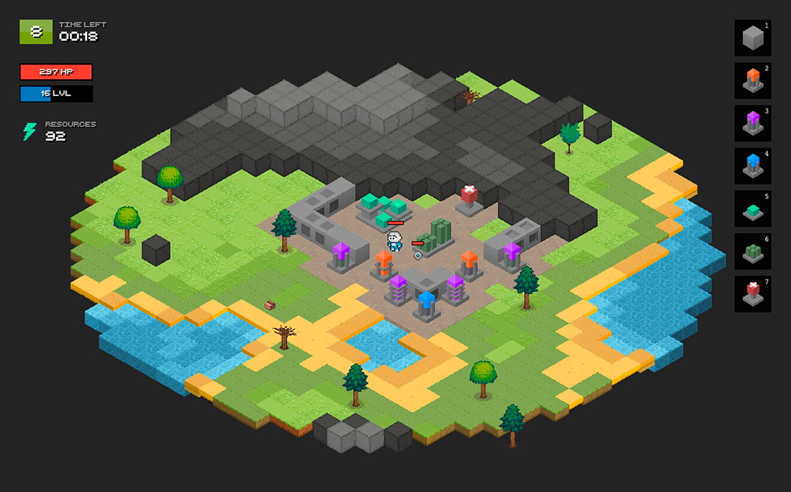
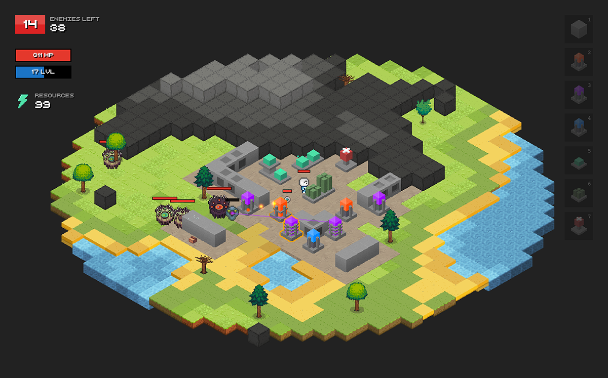
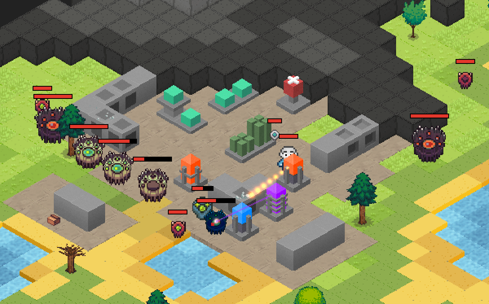
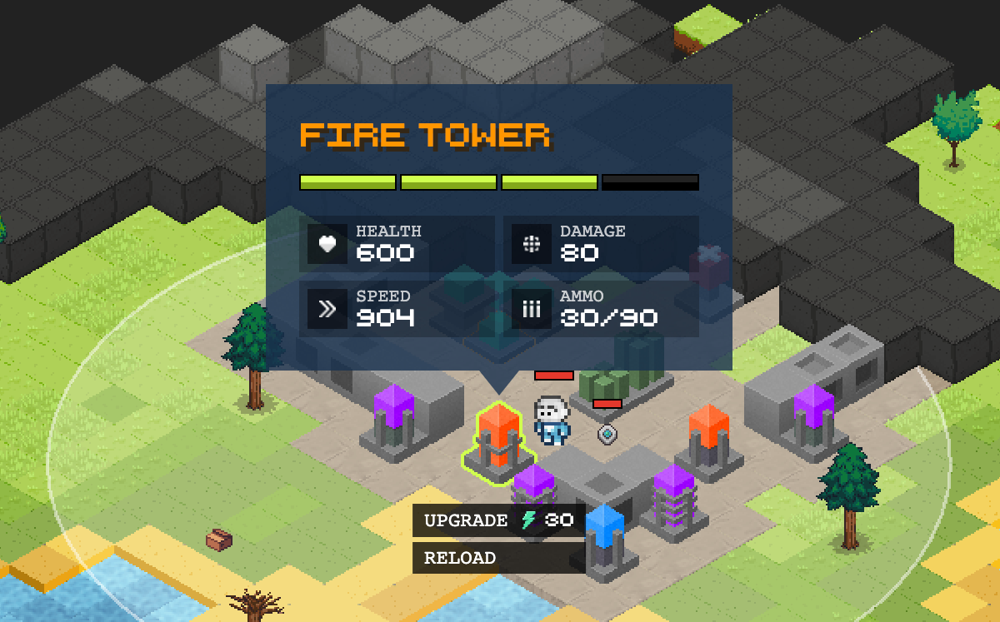

## 

Your task is to survive in open world as many waves as possible. With each wave count of enemies and their characteristics will grow.

Between waves build walls to defend, towers to attack, generators to get resources, ammunitions to reload towers, and medics to replenish your health.

* ## __[Play now](https://izowave.neki.guru)__

|  |  |  |
|---|---|---|

.

## __Technical info__

.

__Install:__

* `git clone git@github.com:neki-dev/izowave.git`
* `npm install`
* `npm start`

.

__Diagram:__ 

* https://miro.com/app/board/uXjVPG81flk=

.

__About:__ 

- Interface

For more convenient drawing of interface using [React](https://react.dev/) library. Сonnection of components with the game is implemented through the React context. State of components is updated using scene events.

- Map

To generate the map using [gen-biome](https://github.com/neki-dev/gen-biome) library, which is based on the perlin noise algorithm.
The output is a 3D matrix, which containing map tiles.

- NPC movement

Path search is implemented on [AStar](https://en.wikipedia.org/wiki/A*_search_algorithm) algorithm.

.

__Stack:__ 

* `TypeScript`, `Phaser`, `React`, `Styled-Components`